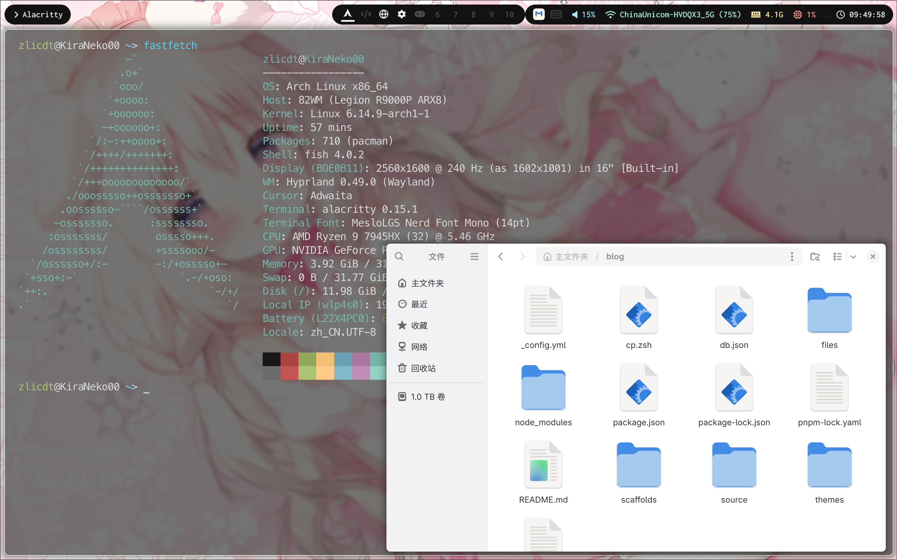

## Dotfiles
This repository stores my desktop configuration. The main branch will keep updated with the configuration on my computer.

By the way, I switched to Fedora GNOME now. Maybe there have some outdated item.

This fork is based on [Cascade's repository](https://github.com/Isoheptane/dotfiles)

### Before Using
Some of the configurations may not fit your environment and may require special attention.

`hypr/hyprland.conf` have special configurations for **NVIDIA grapics cards**. If you are using other graphics adapters, you may need to remove these configs. 

`hypr/hyprland.conf` configured **proxy environment variables**. Remove these proxy settings if you are not using proxy.

### Font Requirements
| Font | Required by |
| :--- | :---------- |
| Inconsolata | Waybar, tofi |
| Symbols Nerd Font | Waybar |
| Fira Code | fontconfig (Font Fallback) |
| Noto Sans CJK TC | Mako |
| Noto Sans CJK SC | Mako, fcitx5 |
| MesloLGS Nerd Font Mono | Kitty |
| Monaco | Hyprlock |

### Port & Customization
Also, some of the configurations may not fit your environment. Here listed some important configurations of them.

### PC Build
PC 1:

| Component | Name |
| --------: | - |
| CPU | AMD Ryzen 9 7945HX |
| Graphics | NVIDIA GeForce RTX 4060 Laptop |
| Monitor | 2560x1600 @ 240Hz |

PC 2:

| Component | Name |
| --------: | - |
| CPU | AMD Ryzen 7 9700X |
| Graphics | NVIDIA GeForce RTX 3080 |
| Monitor | 2560x1440 @ 165Hz |
