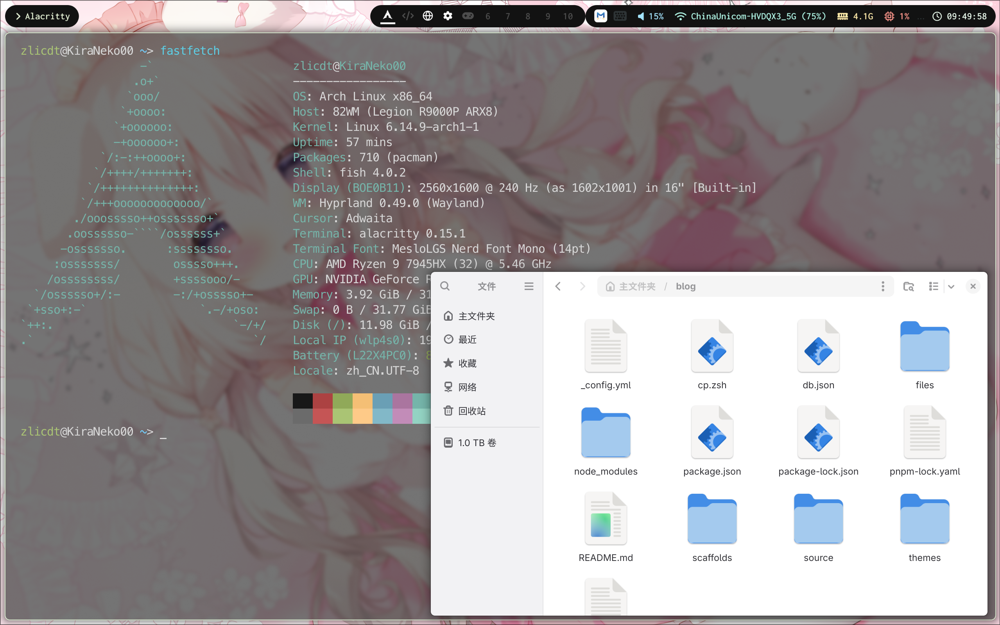

## Dotfiles
This repository stores my desktop configuration. The main branch will keep updated with the configuration on my computer.

My KDE configs are also available. Check `kde` folder for KDE settings config.

This fork is based on [Cascade's repository](https://github.com/Isoheptane/dotfiles)

### Before Using
Some of the configurations may not fit your environment and may require special attention.

`hypr/hyprland.conf` have special configurations for **NVIDIA grapics cards**. If you are using other graphics adapters, you may need to remove these configs. 

`hypr/hyprland.conf` configured **proxy environment variables**. Remove these proxy settings if you are not using proxy.

Removed `fontconfig` because of the Chinese font switch to the `misans` font. This is an AUR package.

### Instructions
Please read this README carefully before using this dotfiles.

> Since Hyprland 0.55, hyprlang changed, I'm trying to ensure it can still work.

For Arch Linux, you can:
```bash
pacstrap /mnt base linux-zen linux-firmware linux-zen-headers base-devel git zsh zsh-completions bash-completion btrfs-progs grub efibootmgr networkmanager openssh vim fcitx5-chinese-addons fcitx5-gtk fcitx5-configtool fastfetch btop eza os-prober
```
This will use zen-kernel, btrfs and fcitx5 as IM. If you are not East Asian, the fcitx5-* is no need.

To install Hyprland ecosystem, do:
```bash
pacman -S hyprland hypridle hyprlock hyprpaper xdg-desktop-portal-hyprland mako waybar kitty uwsm pipewire wireplumber pipewire-pulse pipewire-alsa qt5-wayland qt6-wayland firefox nautilus
```
> Don't forget to enable pipewire.service and wireplumber.service, otherwise you won't have sound in this system.

And for the screenshot, do:
```bash
pacman -S grim slurp wl-clipboard
```

Install my dotfiles:
```bash
git clone https://github.com/zlicdt/dotfiles && cd dotfiles
# note: this is irreversible operation, carefully thinking any important things under .config
./cp.sh
```
> There is one more intelligent script install.sh. But I suggest to do these by yourself, because that install.sh was vibed and need more test ;)

For NVIDIA GPUs driver installation, check https://wiki.archlinux.org/title/NVIDIA

The configs is installed in `~/.config/`.

**If you know what you are doing, you can easily remove the lines for features you don't use.**

The font requirements is in next charapter. You can change that by edit the config file for each program.

#### Monitors
After install, you should take care of the beginning of .config/hypr/hyprland.conf:
```
monitor = , 2560x1600@240, auto, 1.6
monitor = , 3840x2160@160, auto, 2
```
Which is the monitor you plug on, please modify it to fit your machine.

#### Display Manager
For Display Manager by uwsm (similar to sddm or gdm), a TUI DM, already installed in previous command.

You should put these thing to your shell profiles, e.g. `.zshrc`, `.bashrc`, `.zprofile` etc. I suggest `.zshrc` if you're using zsh.
```bash
if uwsm check may-start && uwsm select; then
    exec uwsm start default
fi
```

#### NVIDIA variables
You may see this at about line 243, please remove these if and only if you are not using any NVIDIA GPUs.
```
# NVIDIA Fix, remove if you don't use NVIDIA graphics cards
env = LIBVA_DRIVER_NAME, nvidia
env = XDG_SESSION_TYPE, wayland
env = GBM_BACKEND, nvidia-drm
env = __GLX_VENDOR_LIBRARY_NAME, nvidia
env = WLR_NO_HARDWARE_CURSORS, 1
```

#### fcitx5 variables
If you didn't installed fcitx5, or not using any other IMs, this is harmless.

Otherwise, remove them. Just search `fcitx` in the file and remove related lines.

#### Proxy variables
If you are not using any proxy, you **must** remove them, if not, this will prevent you from the internet.

Search `proxy` and `PROXY`, remove related lines.

This setup is for [sparkle-bin](https://aur.archlinux.org/packages/sparkle-bin)

#### Zsh topics
If you are using zsh, you can copy my `bonus/.zshrc` with some package requirements
```bash
pacman -S zsh-syntax-highlighting zsh-autosuggestions # fish-style suggest
pacman -S pkgfile # command-not-found hook
sudo pkgfile -u
```

And omz installation:
```bash
git clone https://github.com/ohmyzsh/ohmyzsh ~/.oh-my-zsh
```

With powerlevel10k:
```bash
git clone --depth=1 https://github.com/romkatv/powerlevel10k.git "${ZSH_CUSTOM:-$HOME/.oh-my-zsh/custom}/themes/powerlevel10k"
```

Enjoy that.

### Font Requirements
| Font | Required by |
| :--- | :---------- |
| UbuntuMono Nerd Font | Waybar, Hyprlock |
| HarmonyOS Sans SC | Mako, fcitx5 |
| UbuntuMono Nerd Font Mono | Kitty |
| HarmonyOS Sans, adobe-source-han-sans-kr-fonts | Mostly used in UI |

### Port & Customization
Also, some of the configurations may not fit your environment. Here listed some important configurations of them.

### PC Build
PC 1:

| Component | Name |
| --------: | - |
| CPU | AMD Ryzen 9 7945HX |
| Graphics | NVIDIA GeForce RTX 4060 Laptop |
| Monitor | 2560x1600 @ 240Hz |

PC 2:

| Component | Name |
| --------: | - |
| CPU | AMD Ryzen 7 9700X, AMD Ryzen 9 9950X |
| Graphics | NVIDIA GeForce RTX 5070 Ti |
| Monitor | 3840x2160 @ 160Hz |
