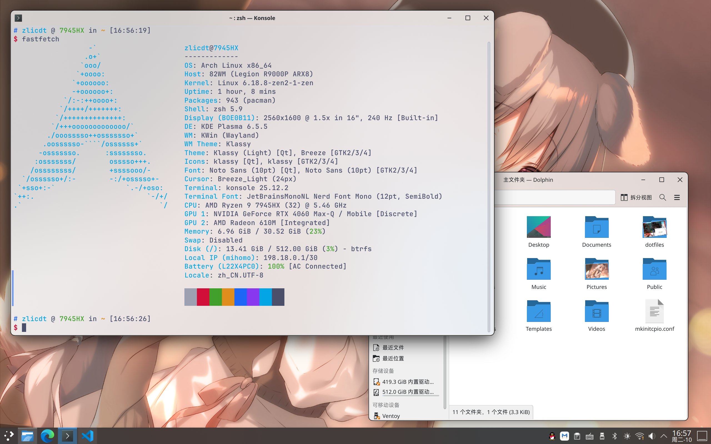

## kde
This repository stores my desktop configuration. The main branch will keep updated with the configuration on my computer.

### Before Using
Some of the configurations may not fit your environment and may require special attention.

Removed `fontconfig` because of the Chinese font switch to the `misans` font. This is an AUR package.

The `.zshrc` is suite with Oh My Zsh. Please install it first before use this `.zshrc`. It alias ls -> eza, cat -> bat. And also fix for npm global package PATH.

### Installed applications
| KDE app groups(as package) |
| :--- |
| plasma |
| kde-utilities |
| kde-system |

| App(as package) | Usage |
| :--- | :--- |
| klassy | Adjust title bar for window |
| sparkle-bin | VPN |
| linuxqq | Chat |
| microsoft-edge-stable-bin | Browser |
| netease-cloud-music-web-player | Netease Cloud Music |
| kwin-effect-rounded-corners | Apply round corner for electron apps|
| visual-studio-code-bin | The VSCode |

### Font Requirements
| Font(as package) | Required by |
| :--- | :---------- |
| ttf-jetbrains-mono-nerd | Konsole, Visual Studio Code |
| misans(AUR) | Chinese font |

### Port & Customization
Also, some of the configurations may not fit your environment. Here listed some important configurations of them.

### PC Build
PC 1:

| Component | Name |
| --------: | - |
| CPU | AMD Ryzen 9 7945HX |
| Graphics | NVIDIA GeForce RTX 4060 Laptop |
| Monitor | 2560x1600 @ 240Hz |

PC 2:

| Component | Name |
| --------: | - |
| CPU | AMD Ryzen 7 9700X, AMD Ryzen 9 9950X |
| Graphics | NVIDIA GeForce RTX 3080 |
| Monitor | 2560x1440 @ 165Hz, 3840x2160 @ 160Hz |
